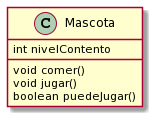
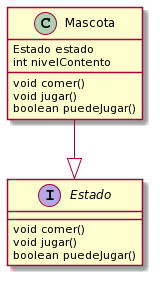
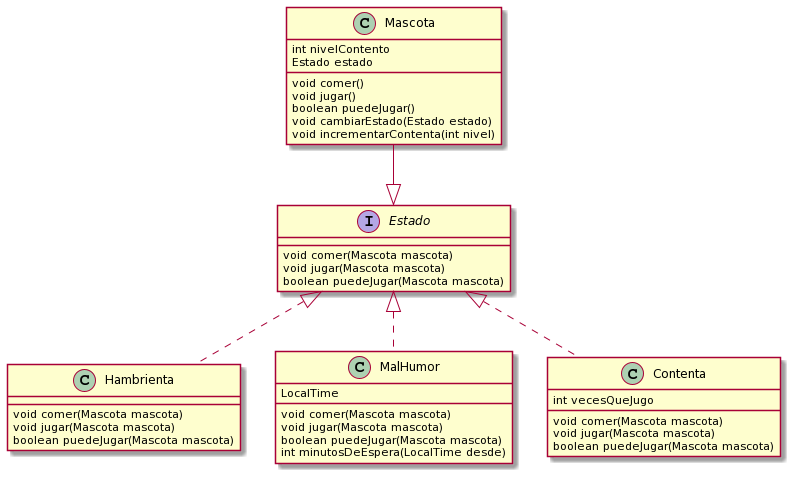

# Tamagotchi

1. Modelar una mascota virtual, del estilo Tamagotchi, de manera que yo pueda usarla para: 

* Pedirle que coma
* Pedirle que juegue
* Preguntarle si puede jugar
También hay que poder conocer qué tan contenta está la mascota, que es un número entero mayor o igual que 0, donde a mayor nivel, más contenta está la mascota.
Una mascota puede estar mal humor, hambrienta o contenta; y su comportamiento depende de en qué estado esté.

Cuando una mascota come, pasa lo siguiente

* Si está hambrienta, se pone contenta. 
* Si está contenta, su nivel se incrementa en una unidad.
* Si está de mal humor, y hace más de 80 minutos que está de mal humor, entonces se pone contenta.
* Si está de mal humor desde hace 80 minutos o menos, entonces no le pasa nada, no cambia nada.

Cuando una mascota juega, pasa lo siguiente

* Si está contenta, su nivel se incrementa en dos unidades. Si llegará a jugar mas de 5 veces se pone hambrienta (jugar da hambre).
* Si está de mal humor, se pone contenta.
* Se pone de mal humor si esta hambrienta.

Una mascota puede jugar si está contenta o de mal humor, si está hambrienta no.

NO SE PUEDE CONSULTAR DE NINGUNA MANERA EL ESTADO ACTUAL DE LA MASCOTA.

Esto quiere decir que está prohibido hacer comparaciones del tipo estado.equals("contento") o cualquiera similar utilizando mensajes especiales.

2. Responder las siguientes preguntas:
    * Indique en palabras los pasos necesarios para incorporar un nuevo estado “Triste” en la mascota, de manera que quede listo para funcionar.
    * Indique cómo resolvería para darles de comer a todas las mascotas que están dentro de una colección “mascotas”.


## Solucion
1. Lo primero que haremos es pensar en una clase Mascota, que tendrá un nivelContento (un número entero mayor o igual que 0) y conocerá los mensajes comer(),jugar() y puedeJugar(). Este último lo podemos modelar con un retorno booleano, ya que espero una respuesta por Sí o por no.
```java
class Mascota{
int nivelContento;

public void comer(){
}

public void jugar(){
}

public boolean puedeJugar(){
}

}
```


2. Luego tenemos que pensar en si una mascota está hambrienga, contenta o de mal humor. Pueden surgir varias alternativas.

   * String estado . Esta es una solución muy rústica y por lo general una mala decisión. Para saber cómo está una mascota vamos a tener un método lleno de if's con comparaciones al estilo if(estado=="Contenta") cosa que casi siempre se quiere evitar, para eso proponemos la segunda solución.
   * El estado es un objeto "intercambiable" que la mascota conoce. Esta es la solución que nos va a servir para plantear los siguientes requerimientos, ya que al tener un           objeto que haga de estado, podemos delegarle algunos comportamientos.
   
Los estados tienen comportamiento diferente para una misma acción, pero nosotros no podemos conocerlos (¡Lo dice el enunciado!), entonces queremos objetos que entiendan el mismo mensaje indistintamente para nosotros y sean ellos los responsables del comportamiento en cada caso. Para esto podemos plantear una inferaz Estado que será el contrato para los mensajes que entenderá cada estado.
Para lograr la diferencia de comportamiento, para cada mensaje, vamosa a definir comer(),jugar() y puedeJugar() al estado además de a la mascota. Así, si la mascota quiere jugar(), le delegará esta acción a su estado.

```java
interface Estado{
public void jugar()
public void comer()
public boolean puedeJugar()
}

...
class Mascota{
int nivelContento;
Estado estado
public void comer(){
   estado.comer()
}

public void jugar(){
   estado.comer()
}

public boolean puedeJugar(){
   estado.comer()
}


```


3. Así tenemos a nuestra mascota, con su atributo Estado, que por ahora solo es una interface, pero será un objeto intercambiable. Para esto, creamos las clases Contenta,Hambrienta,MalHumor que implementen a la inferfaz Estado. También haremos una modificación para el mensaje comer,jugar y puedeJugar de los Estados, pasandoles la mascota por parámetro así no tiene que ser conocida por el mismo. Con estas aclaraciones podemos arrancar a codear los comportamientos para los 3 mensajes que conoce la mascota. ¡Pará! Hay un pequeño problema: por ejemplo, cuando una mascota está hambrienta y come, su estado pasa a ser Contenta. Para esto tenemos un par de opciones, nosotros vamos a obtar por decirle a la Mascota que se setee el estado, así con un solo método lo tenemos resuelto. (En vez de tener setearContenta(), setearHambrienta...).

Todavía no terminamos, si nos fijamos, hay algunos requerimientos que necesitan conocer el tiempo para poder decidir sobre qué va a pasar. Vamos a suponer que tenemos un método genérico minutosDeEspera que nos devuelve cúantos minutos lleva una Mascota esperando desde cierto tiempo. Para este requerimiento, agregaremos algún atributo de tiempo a la Clase MalHumor que será seteada en el momento que la mascota esté de mal humor (pasando por contrusctor a la clase MalHumor).

```java
class MalHumor implements Estado{
LocalTime tiempo;
...

public int minutosDeEspera(LocalTime desde){...}
}
```

Ahora sí podemos seguir con el resto de los requerimientos. Pasamos al limpio todo, y completamos según corresponda los métodos.

```java
interface Estado{
   public void jugar()
   public void comer()
   public boolean puedeJugar()
}

class Contenta implements Estado{
int vecesQueJugo;
   public Contenta(){
   vecesQueJugo = 0;
   }
   
   public void jugar(Mascota mascota){
      mascota.incrementarContenta(2);
      vecesQueJugo++;
      if(vecesQueJugo>5)
         mascota.cambiarEstado(new Hambrienta());
   }
   public void comer(Mascota mascota){
      mascota.incrementarContenta(1);
   }
   public boolean puedeJugar(Mascota mascota){
      return true;
   }
}

class Hambrienta implements Estado{
   public void jugar(Mascota mascota){
      mascota.cambiarEstado( new MalHumor(now()) );
   }
   public void comer(Mascota mascota){
      mascota.cambiarEstado(new Contento());
   }
   public boolean puedeJugar(Mascota mascota){
      return false;
   }
}

class MalHumor implements Estado{
   LocalTime tiempo;
   
   public MalHumor(LocalTime tiempo){
      tiempo = tiempo;
   }
   
   public void jugar(Mascota mascota){
      mascota.cambiarEstado(new Contenta());
   }
   public void comer(Mascota mascota){
      if(minutosDeEspera(tiempo)>80){
         mascota.cambiarEstado(new Contenta());
      }
      //else no hace nada!
   }
   public boolean puedeJugar(Mascota mascota){
      return true;
   }
}

class Mascota{
   int nivelContento;
   Estado estado
   
   public void comer(){
      estado.comer(self);
   }

   public void jugar(){
      estado.jugar(self);
   }

   public boolean puedeJugar(){
      return estado.puedeJugar(self);
   }

   public void cambiarEstado(Estado estado){
      estado=estado;
   }
   
   public void incrementarContenta(Int nivel){
      nivelContento+=nivel;
   }
}

```
El diagrama de clases completo nos queda así:



Ahora pasemos a responder lo preguntado más abajo.

a. Indique en palabras los pasos necesarios para incorporar un nuevo estado “Triste” en la mascota, de manera que quede listo para funcionar.

Para hacer esto es tan fácil como agregar una clase Triste que implemente a Estado.

b. Indique cómo resolvería para darles de comer a todas las mascotas que están dentro de una colección “mascotas”.

Para esto vamos a poner un poco de código.
```
List<Mascota> mascotas;

public void alimentarMascotas(){
   mascotas
   .forEach(
   {unaMascota -> unaMascota.comer()}
   );
}

```

Con esto queda resuelto el ejercicio Tamagotchi!

Como pueden ver, la solución usa sintaxis de Java. Sin embargo, es probable que se haya podido entender sin problemas, ya que lo evaluado acá no es el lenguaje, sino el uso del paradigma de objetos. 
#### Aclaracion: 
Por qué los estados son una clase si no tienen estado? (teniendo en cuenta de que el tiempo de mal humor y la cantidad de veces que jugó podrían ser conocidos por la mascota) Porque en Java no hay objects y esta solución está pensada en Java.

Para pensar:
¿Qué pasaría si pudiera bajarle el nivel de contenta a la mascota? ¿Qué debería cambiar?
¿Qué otra forma se te ocurre de resolver los estados sin utilizar una interface?


